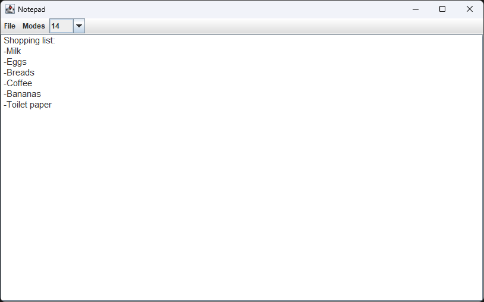
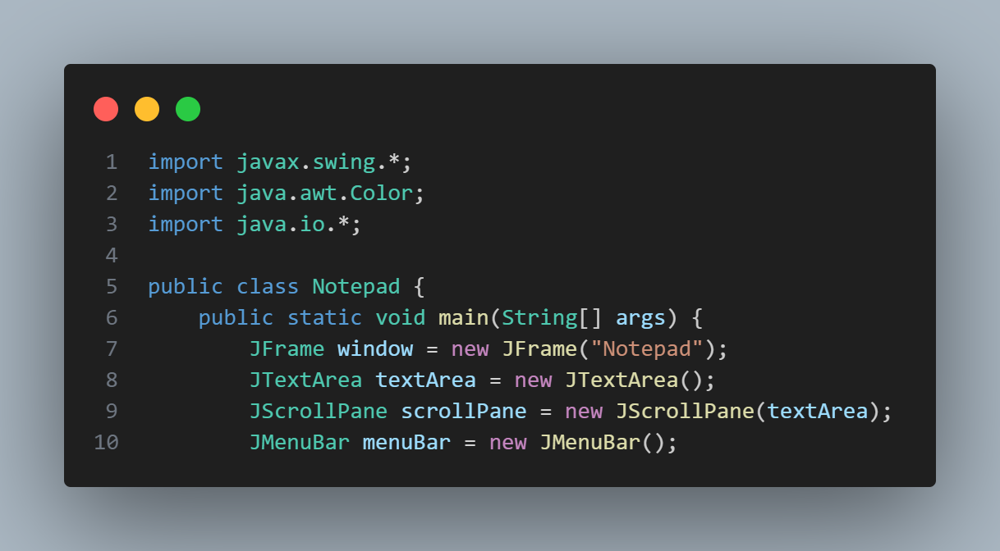

## Notepad in Java
A simple text editor written in Java using Swing. Supports basic text file operations.

Open, save, edit .txt files.

## Requirements

- Java Development Kit (JDK) version **1.8.0 or higher**
- Works on both 32-bit and 64-bit systems
- No separate JRE installation required

## Open Source

The source code of this project is fully open and free to use.  
Feel free to modify, extend, or incorporate it into your own projects without restrictions.

## License

This project is licensed under The Unlicense, meaning it's fully in the public domain. You can use, modify, and distribute the code without any restrictions.

### 🔥Enjoy using it!🔥
